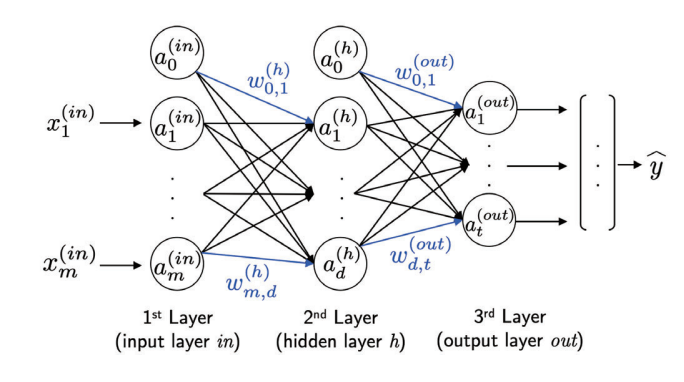
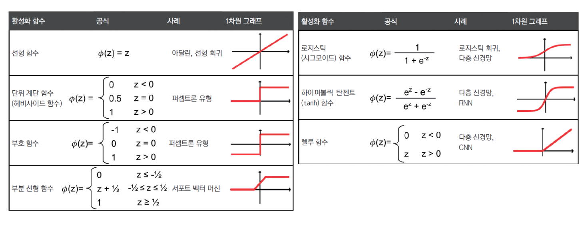

# 머신러닝 기초

## Perceptron
* 1943년 최초의 간소화된 뇌의 뉴런 개념 제시

* 출력이 binary인 간단한 모델
* 수상 돌기에 도착한 여러 신호가 세포체에서 합쳐짐
* 합쳐진 신호가 특정 값을 넘으면 축삭 돌기를 이용하여 출력 신호를 전달

* 퍼셉트론: 뉴런의 구조를 단순화하여 수식으로 만듬

## MLP(Multi Layer Perceptron)

기존 퍼셉트론은 선형적으로 분리되는 것만 예측 가능했다. XOR 같은 비선형적인 연산은 계산이 불가능하였고, 이를 해결하기 위해 Multi Layer Perceptron이 출현하였다. 차원을 높혀 비선형 함수를 적용하면 비선형적인 연산도 해결이 가능하다. 

* hidden layer의 추가

## CNN(Convolutional Neural Network)

머신 러닝에서는 추정하고자 하는 값과 밀접한 관계가 있는 특성을 이용하는 것이 중요하다. CNN을 사용하면 이미지 같은 데이터에서 MLP에 비해 parameter 수를 훨씬 줄이면서 정보를 추출할 수 있다.(Parameter Sharing)

* 여러개의 Convolutional Layer와 Pooling같은 Subsampling Layer로 구성
* Classification에서는 마지막 Layer는 FUlly Connected Layer로 구성

> convolution 연산은 어떤 신호를 filtering 하는 것

### Padding
padding이 없으면 경계 값의 정보가 유실 될 수 있다

### Pooling
데이터를 압축하기 위한 Layer
* Max-Pooling : 구간에서 가장 큰 값으로 계산
* Mean-Pooling :  구간의 평균으로 계산

### Dropout
Hidden Unit의 일부를 일정 확률 p로 제거(Regularization 기법)

### Activation Functions
non-linearity를 위한 활성화 함수

## ONNX(Open Neural Network Exchange)
다른 언어, 환경으로 제작한 모델을 옮기는 것