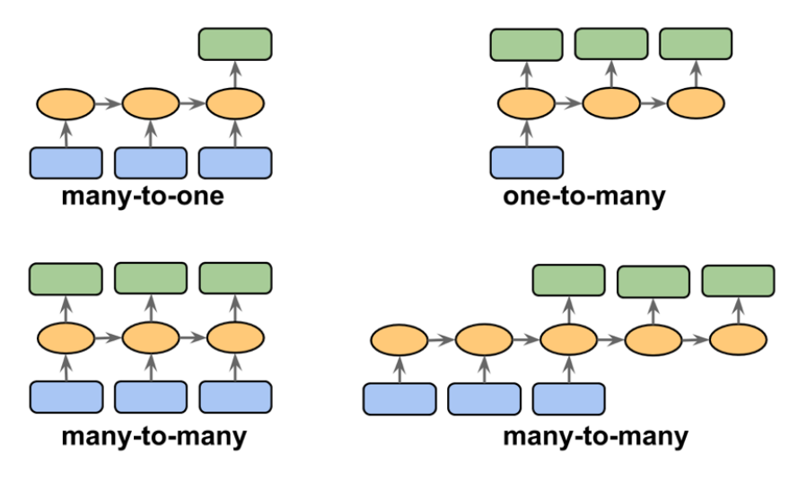
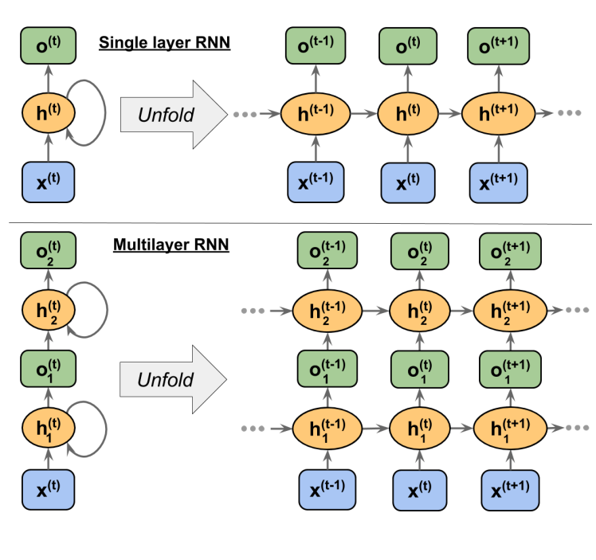
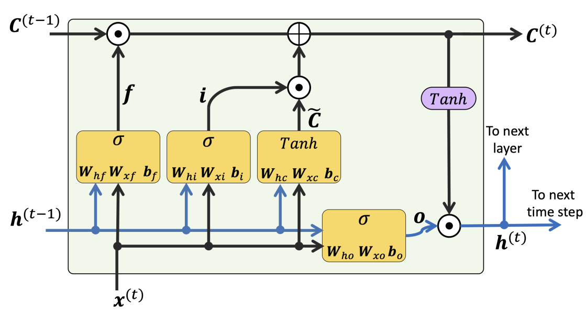

# RNN(Recurrent Nerual Network)
시간/순서의 관계가 있는 데이터에서 강점을 가지는 신경망 모델

## Sequence Data

## Sequence Modeling

- many-to-one
- one-to-many
- many-to-many

## Recurrent Neural  Network
Feedforward Network와 다르게 RNN은 이전의 Hidden Layer로 부터 정보를 받음 (Loop)

## BPTT(Backpropagation Through Time)
시간축에 따라 역전파를 수행하는데, Gradient 크기에 따라 Exploding 또는 Vanishing Gradient 문제가 발생

- solution
    - LSTM
    - Gradient Clipping

## LSTM(Long-Short Term Memory)

게이트로 정보를 제어

RNN과 다르게 각 셀에서 저장하는 Cell state가 존재한다.

- **Forget Gate(삭제 게이트)** 메모리 셀의 무한 성장을 막기 위한 게이트
- **Input Gate(입력 게이트)** Cell State를 업데이트
- **Output Gate(출력 게이트)** 출력을 업데이트

## Text to Positive/Negative
- 자연어를 단어 단위로 쪼갠다.(Word Tokenization)
- 총 q개의 token 생성, 알려지지 않은 단어(아주 덜 쓰이는 단어)는 q+1로 일괄 할당

- mini-batch를 만들기 위해 Sequence 길이가 동일해야함
    - zero-padding 추가하여 길이 통일
- 문장 Encoding을 위한 Embedding이 필요
    - One-hot Encoding
    - 전체 단어 수 만큼의 Vector 사용
- 효율적인 처리를 위해 각 단어를 실수 값을 가지는 Fixed-Length Vector로 변환 ($d_{embedding} << n_{words}$)
- 학습을 통해 **Embedding** 추출