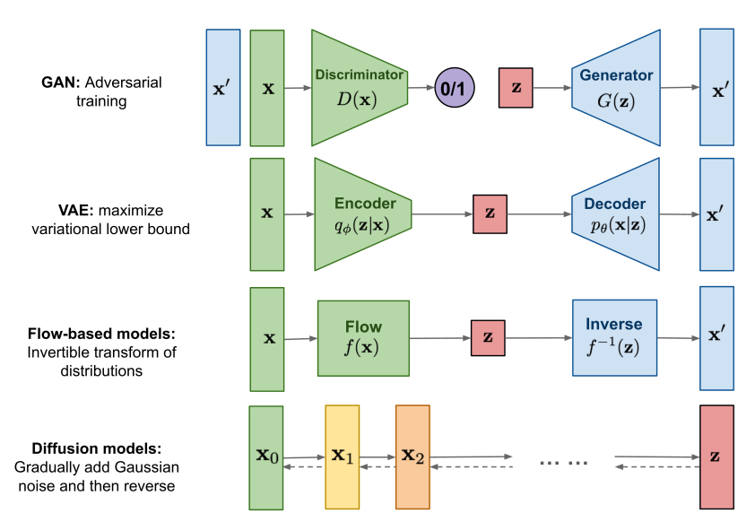
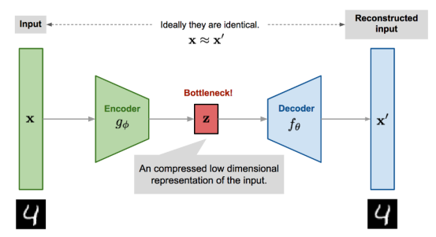
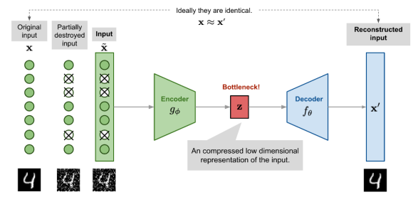
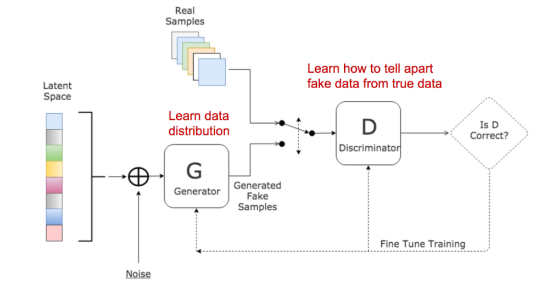
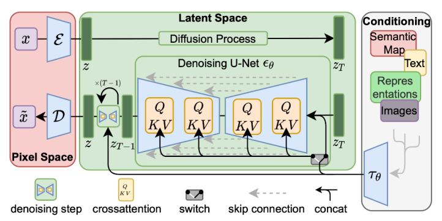
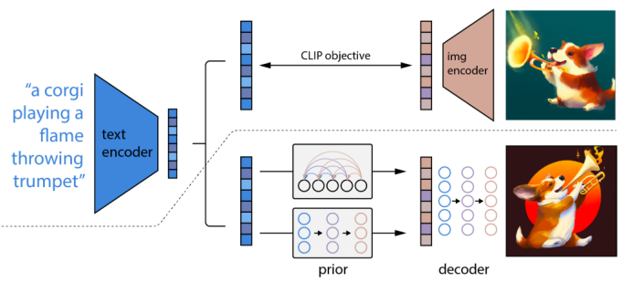

# Generative Models

새로운 데이터를 만들 수 있는 모델

**엄밀한 구분**
- data instaces X and a set of labels Y:
    - **Generative** : models capture the joint probability $p(X, Y)$, or just $p(X)$ if there are no labels.
    - **Discriminative** : models capture the conditional probalbility $p(Y|X)$.

## Autoencoders(AEs)
비지도 학습으로 identity function을 학습하는 신경망

- **Encoder network**: low-dimensional code로 압축
- **Decoder network**: high-dimensional code로 복원

입력과 동일한 값을 생성할 수 있도록 학습

### Denoising Autoencoders(DAEs)

입력에 노이즈가 있어도 노이즈가 없는 원본 입력을 만드는 것

## Generative Adversarial Networks(GANs)

- **discriminator D** : 실제 데이터 인지 generator가 만든건지 판별기
- **generator G**: 실제 데이터와 비슷한 데이터 생성기

discriminator와 generator가 경쟁을 하며 Generator의 성능이 높아져 생성을 잘 하게 된다.

### Mode Collapse

항상 같은 output을 만드는 문제가 생길 수 있다.

## Diffusion Models

노이즈 이미지에서부터 이미지를 생성해낸다.

1. 입력 고화질 이미지를 넣는다
2. 조금 더 노이즈를 넣는 이미지를 반복해서 넣는다.
3. 짝이 되는 노이즈를 찾는다.
4. 노이즈로부터 거슬러 갈 수 있으면 이미지를 생성 가능하다.

### CLIP
text로부터의 특징 추출과 이미지로부터의 특징 추출이 같도록 하는 기술

text로 이미지 생성이 용이하게 한다!