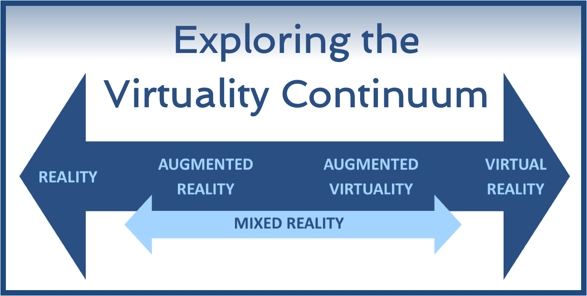

# 유니티를 활용한 VR 콘텐츠 제작 실습 및 연구 주제 탐구

- 1주차 : 소개
- 2주차: Ocuus Quest 2 VR 개발환경 구성 및 실습
- 3주차: Smartphone based AR 개발 실습
- 4주차: Virtual Human 개발 실습
- 5주차: VR 연구 리뷰 및 발표

## Virtual Reality Technologies

### Virtual Reality

VR에서 user's presence를 제공하는걸 지향한다.

- 모든 감각들을 구현하기엔 한계가 존재
    - sight sound 정도만 현재로써 가능
    - 맛과 냄새는 아직 힘들다.
- 현재 장치로써는 HMD(Head Mount Display)가 가장 많이 쓰인다.

### Fully Immersive VR Experience

어떤 방향으로 보아도 가상 환경이 보여야한다.(user를 완벽히 에워싸야한다.)

- HMD를 쓰면 어딜 봐도 가상환경을 볼 수 있다.

### Application

- simulation & training
- visualization & entertainment
- remote control of vehicles, e.g. drones
- gaming
- robotic surgery
- architecture walkthroughs
- education
- virtual travel

## Engineering Aspects of VR/AR

HoloLens 2가 현재 앞서고 있다.

## History of Virtual Reality

1. 1838: Stereoscopes - Wheatstone, Brewster
2. 1968: VR & AR - Ivan Sutherland
3. 1995: Nintendo Virtual Boy
4. 2012 ~ : VR explosion - Oculus, Sony, HTC, MS, ..

## What is Metaverse?

- **Meta(former facebook)**
    - VR(Spectrum Technology)
    - Social(Interaction)

## VR Spectrum Technologies

- Reality-Virtuality Continuum  
    - Reality
    - AR(Augmented Reality)
    - MR(Mixed Reality)
        - AR과 AV
    - VR(Virtual Reality)

### XR(eXtend Reality)

VR, AR, MR을 합쳐서 부르는 것

## Haptic Feedback
- passive haptic feedback
- active haptic feedback

## Presence, Co-Presence, Social Presence

- Presence: 내가 이 공간에 있다
- Co-Presence: 내가 다른 사람과 있다.
- Social Presence: 내가 사회적으로 다른 사람들과 연결되어 있다.

## Sensorimoter Contingencies

물체가 실제로 만져진다고 착각하게 만들어 presence를 유발 시킨다.

- 필요한 장치
    - Position/pose Tracker
    - Visual Display
    - Haptic Display

## AR(Augmented Reality)

## Virtual Human

가상의 사람을 구현

- Avartar: 사람과 동기화되어 움직이는 가상 인간
- Agent: 프로그래밍된 동작을 자동으로 수행하는 가상 인간(NPC)

## VR/AR Conetns Creation
Unity와 UNREAL이 대표적인 툴이다.

실습에선 Unity를 사용예정이다.